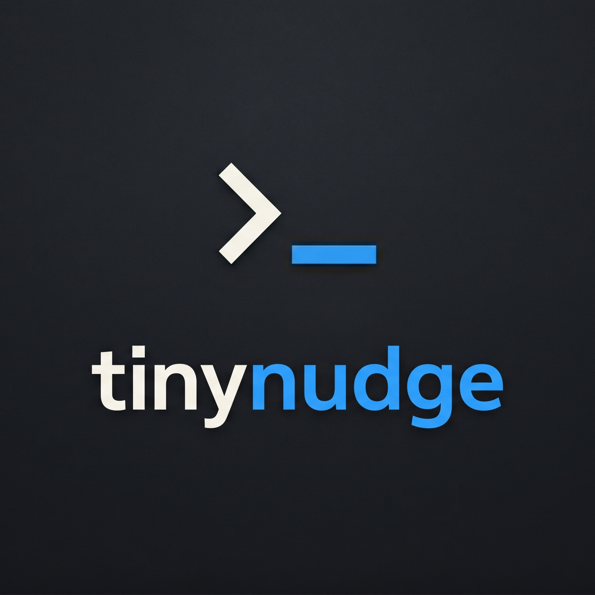

<div align="center">
  
  <p><strong>A tiny notifier for AI coding agents.</strong></p>
  <p>Get a banner + sound when your agent finishes a task or pauses for your approval — step away without missing a beat.</p>
</div>

---

## Supports

| Agent | Status |
|-------|--------|
| Claude Code | ✅ |
| Cursor | ✅ |
| Gemini CLI | ✅ *(experimental)* |
| Codex | ✅ *(experimental)* |
| Any hooks-capable agent | ✅ — point it at `notify.sh` |

**Platforms:** macOS (native banners + click-to-focus) · Linux (PulseAudio / ALSA / libnotify) · Windows (Git Bash / WSL)

## Install

### macOS (recommended)

```bash
brew install hiskuDN/tap/tinynudge
tinynudge-setup
```

`brew install` gets you the native app. `tinynudge-setup` auto-detects your agents (`~/.claude`, `~/.cursor`) and wires their hooks.

### All platforms / manual

```bash
git clone https://github.com/hiskuDN/tinynudge.git
cd tinynudge
./install.sh
```

The installer auto-detects agents and wires hooks. On macOS it will also prompt you to install the native binary via Homebrew if you haven't already.

## How it works

Each supported agent has a hooks system. `tinynudge` registers these hooks:

| Agent | Event | What happens |
|-------|-------|--------------|
| Claude Code | `Stop` | Banner when the turn ends |
| Claude Code | `PermissionRequest` | Banner when Claude pauses for approval |
| Cursor | `stop` | Banner when agent turn ends |
| Gemini CLI | session end | Banner when agent finishes |

The hook calls `notify.sh <agent> <event>`, which plays a sound and shows a banner via:

1. **macOS** — the native `tinynudge.app` (click-to-focus routes back to your editor)
2. **Linux** — `paplay` / `aplay` / `notify-send`
3. **Windows** — `powershell [console]::beep`

### Click-to-focus (macOS)

When you click the banner, `tinynudge.app` uses System Events to raise the exact window that triggered the notification — even if you have multiple Cursor or terminal windows open. Supported apps:

- Cursor, VS Code
- iTerm2, Warp, Ghostty, Terminal.app

If the target app is already in focus when the notification fires, the banner is suppressed and only the sound plays.

### Immediate focus mode

If you'd rather have your editor focus automatically — no click needed:

```bash
export TINYNUDGE_ACTIVATE_IMMEDIATELY=true
```

Add that to your shell profile.

### Voice notifications

tinynudge can speak notifications aloud using [StackVox](https://github.com/StackOneHQ/stackvox), an offline TTS library with ~13 ms latency.

**Setup:**

```bash
pip install stackvox
stackvox serve   # start the daemon (add to login items or a launch agent)
```

**Enable in your config** (`~/.tinynudge/config`):

```bash
TINYNUDGE_VOICE=true
```

Voice fires only when the banner shows — it's suppressed along with the banner when your editor is already in focus. For permission events, voice says *"Bash command needs approval"* or *"Edit: filename"* rather than reading the raw command aloud.

Optional tuning (also in `~/.tinynudge/config`):

```bash
TINYNUDGE_VOICE_NAME=af_heart   # StackVox voice ID
TINYNUDGE_VOICE_SPEED=1.1       # playback speed (1.0 = normal)
```

## Sounds

| Event | macOS | Linux | Windows |
|-------|-------|-------|---------|
| Agent done | `Glass.aiff` | freedesktop bell | 800 Hz beep |
| Waiting for approval | `Ping.aiff` | freedesktop bell | 1200 Hz beep |

Any file from `/System/Library/Sounds/` works on macOS: Basso, Blow, Bottle, Frog, Funk, Glass, Hero, Morse, Ping, Pop, Purr, Sosumi, Submarine, Tink.

## Uninstall

```bash
./uninstall.sh
```

Removes hooks from each agent's config and deletes `~/.tinynudge/`. To also remove the binary: `brew uninstall tinynudge`.

## Manual setup

Every supported agent just needs a hook that runs `notify.sh <agent-name> <event>`. Example for Codex (or any other hooks-capable agent):

```json
{
  "hooks": {
    "stop": [
      {
        "type": "command",
        "command": "$HOME/.tinynudge/notify.sh codex stop"
      }
    ]
  }
}
```

## Development

```bash
./build.sh            # builds tinynudge.app into build/
```

The Swift source lives in `notifier/` — ~200 lines, compiled with `swiftc`. No Xcode, no SPM, no dependencies.

## Credits

Click-routing architecture (process exits after delivery, macOS re-launches on click) is adapted from [`terminal-notifier`](https://github.com/julienXX/terminal-notifier) by Eloy Durán and Julien Blanchard.

## License

MIT
